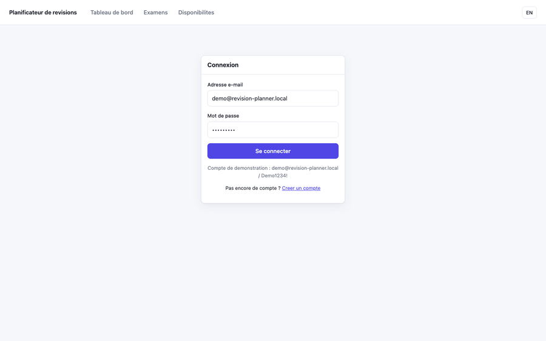
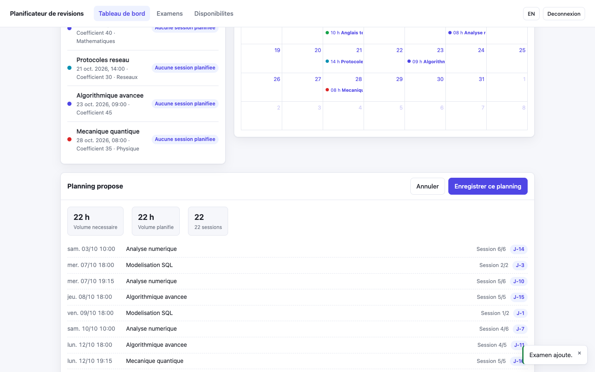
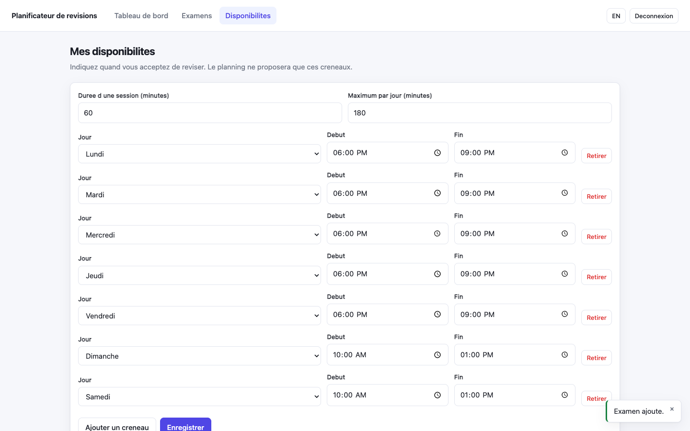

<h1 align="center">Planificateur de révisions</h1>

<p align="center">
  <em>Vos examens d'un côté, un planning de révision de l'autre.</em>
</p>

<p align="center">
  
  
  
  
  
</p>

---

Un étudiant connaît ses échéances. Ce qu'il sait mal faire, c'est **répartir son
travail** entre elles : tout réviser la veille, oublier les matières lointaines,
ou planifier des séances à des heures où il n'est pas disponible.

Cette application résout ce problème. L'étudiant saisit ses examens avec leur
coefficient et leur matière, déclare quand il accepte de réviser, et obtient un
planning concret — des séances datées, placées dans son calendrier, pondérées par
l'importance de chaque épreuve et espacées selon le principe de la **répétition
espacée**.



> Parcours complet : connexion, ajout d'un examen, déclaration des disponibilités,
> génération puis enregistrement du planning. Vidéo en meilleure définition :
> [`docs/media/demonstration.mp4`](docs/media/demonstration.mp4).

---

## Démarrage

```bash
npm install
npm run dev
```

| | |
|---|---|
| Interface | <http://localhost:5173> |
| API et administration Strapi | <http://localhost:1337> |
| Compte de démonstration | `demo@revision-planner.local` / `Demo1234!` |

Au premier démarrage, le backend crée la base SQLite, applique les permissions et
injecte un jeu de données de démonstration — 5 matières, 5 examens, un compte prêt
à l'emploi. **Aucune configuration manuelle n'est nécessaire.** Les dates des
examens sont relatives au jour du démarrage : la démonstration reste pertinente
quelle que soit la date à laquelle le dépôt est cloné.

```bash
npm test          # 45 tests
npm run typecheck # TypeScript strict sur les trois paquets
```

---

## Le moteur de planification

C'est le cœur du projet. [`packages/core`](packages/core) ne dépend ni de React ni
de Strapi : du TypeScript pur, donc testable et réutilisable.

### Combien de temps pour chaque examen

Le volume accordé dépend du **coefficient** et de la **difficulté de la matière** :

```
minutes = coefficient × 6 × facteur       facile 0,75 · moyen 1 · difficile 1,35
```

arrondi au multiple supérieur d'une séance — on ne planifie pas un tiers de séance.
Sur le jeu de démonstration :

| Examen | Coefficient | Difficulté | Séances |
|---|:--:|:--:|:--:|
| Anglais technique | 10 | facile | **1** |
| Modélisation SQL | 20 | moyen | **2** |
| Protocoles réseau | 30 | moyen | **3** |
| Mécanique quantique | 35 | difficile | **5** |
| Analyse numérique | 40 | difficile | **6** |

### Quand les placer

Les séances sont espacées par intervalles **croissants** avant l'épreuve — J-1,
J-3, J-6, J-10, J-15… La révision est dense à l'approche de l'examen et de plus en
plus espacée en remontant dans le temps, ce qui favorise la mémorisation durable.

Quand l'examen est trop proche pour cette progression, les décalages sont comprimés
proportionnellement pour tenir dans la fenêtre disponible — sans quoi la moitié des
séances viserait des dates déjà passées.

### Ce que le moteur garantit

- aucune séance **dans le passé**, ni après la date de l'examen concerné ;
- une **marge de repos** configurable avant chaque épreuve ;
- **aucun chevauchement** entre deux séances, y compris pour des examens différents ;
- les **créneaux de disponibilité**, les pauses et le plafond journalier sont respectés ;
- les **échéances proches sont prioritaires** en cas de pénurie de créneaux ;
- un **diagnostic explicite** quand une séance ne peut pas être placée, avec sa cause ;
- un résultat **déterministe** à données identiques.

Chacune de ces garanties est vérifiée par un test.

---

## Aperçu

| Prévisualisation avant enregistrement | Déclaration des disponibilités |
|---|---|
|  |  |
| Le planning est calculé, présenté avec ses diagnostics, et n'est enregistré qu'après confirmation. | Le planning ne propose que les plages déclarées par l'étudiant. |

---

## Architecture

```
revision-planner/
├── packages/core/   Moteur de planification — TypeScript pur, 32 tests
├── apps/api/        Backend Strapi 5 — schémas, permissions, données de démo
├── apps/web/        Frontend React 18 + Vite + Redux Toolkit, 13 tests
├── scripts/         Capture automatisée de la démonstration
└── docs/            Rapport technique et médias
```

Le choix d'un monorepo permet au front et au moteur de partager exactement les
mêmes types, sans duplication ni paquet intermédiaire à publier.

### Modèle de données

| Type | Rôle |
|---|---|
| `student` | Profil étudiant, rattaché à un compte, porteur des disponibilités |
| `subject` | Matière et sa difficulté |
| `exam` | Épreuve : intitulé, date, coefficient, type, matière |
| `revision-session` | Créneau de révision généré, rattaché à un examen |

Les schémas sont **versionnés** dans [`apps/api/src/api/`](apps/api/src/api), et
les permissions du rôle `authenticated` sont appliquées **par code** au démarrage
([`permissions.ts`](apps/api/src/bootstrap/permissions.ts)). Une installation
neuve est donc reproductible, sans réglage manuel dans l'administration.

### Cloisonnement des données

Chaque requête est filtrée **côté serveur** par le profil étudiant du compte
appelant. Les contrôleurs imposent la relation `student` en lecture comme en
écriture : un examen ne peut être ni créé pour autrui, ni réaffecté. Une requête
sans jeton reçoit un `403`. Le filtrage n'est jamais délégué au navigateur.

### Variante PostgreSQL

SQLite suffit au développement. Pour se rapprocher d'un déploiement réel :

```bash
docker compose up -d postgres
DATABASE_CLIENT=postgres DATABASE_HOST=localhost DATABASE_PORT=5432 \
DATABASE_NAME=revision_planner DATABASE_USERNAME=strapi DATABASE_PASSWORD=strapi \
npm run dev
```

---

## La démonstration est reproductible

```bash
npm run demo:capture
```

Le script [`capture-demo.mjs`](scripts/capture-demo.mjs) réinitialise les données,
pilote l'application avec Playwright, enregistre une image à chaque étape, puis
assemble la vidéo et le GIF avec ffmpeg. La démonstration se régénère donc après
chaque évolution de l'interface, au lieu d'être un enregistrement manuel vite
périmé.

---

## Origine du projet

Ce projet est né d'un **stage d'un mois chez [Anypli](https://anypli.com), en
Tunisie**, pendant l'été 2025.

Je n'avais alors **aucune expérience du développement web**. TypeScript, React,
Redux, le fonctionnement d'une API REST, un CMS découplé comme Strapi : tout a été
découvert sur place, à partir de zéro, en quatre semaines — en même temps que
l'application se construisait. L'historique Git de ce dépôt en conserve la trace,
des premiers essais de mi-juillet 2025 à la version livrée le 15 août.

Apprendre une pile technique entière et livrer dans le même mois impose des
compromis. L'application fonctionnait et répondait au besoin, mais elle portait les
marques de cet apprentissage accéléré. La refonte qui a suivi relève d'une autre
compétence : non plus faire fonctionner, mais rendre **fiable**.

| | Version du stage | Après refonte |
|---|---|---|
| Backend | configuré à la main, non versionné | schémas, permissions et données dans le dépôt |
| Lancement par un tiers | impossible | `npm install && npm run dev` |
| Planification | 18 lignes : coefficient ÷ 10, toujours 18 h | moteur isolé : difficulté, disponibilités, collisions, diagnostics |
| Séances dans le passé | générées | impossibles par construction |
| Filtrage des données | navigateur, après avoir tout téléchargé | serveur, par contrôleur |
| Noms de relations | devinés à l'exécution parmi trois candidats | modèle fixe et typé |
| Retours utilisateur | `alert()` bloquants | notifications et prévisualisation |
| Tests | 1 test de fumée | **45** |
| TypeScript | `any` omniprésent | strict, sans `any` |

Les 22 premiers commits de ce dépôt sont ceux du stage ; ils n'ont pas été
modifiés. Le commit *« Retirer la version 1 avant la refonte »* marque la bascule.

📄 **[Rapport technique complet](docs/rapport/rapport.pdf)** — contexte du stage,
technologies découvertes, algorithme détaillé, difficultés rencontrées et bilan
d'apprentissage. Source LaTeX : [`docs/rapport/rapport.tex`](docs/rapport/rapport.tex).

---

## Note de développement

Ne placez pas ce dépôt dans un dossier synchronisé par iCloud Drive (Bureau,
Documents) ni OneDrive : les démons de synchronisation génèrent des événements
système que les observateurs de fichiers de Vite et de Strapi interprètent comme
des modifications, ce qui provoque des redémarrages en boucle — sans compter la
synchronisation inutile de `node_modules`.

---

<p align="center"><sub>Mohamed Aziz Baoueb — stage chez Anypli, Tunisie, été 2025</sub></p>
