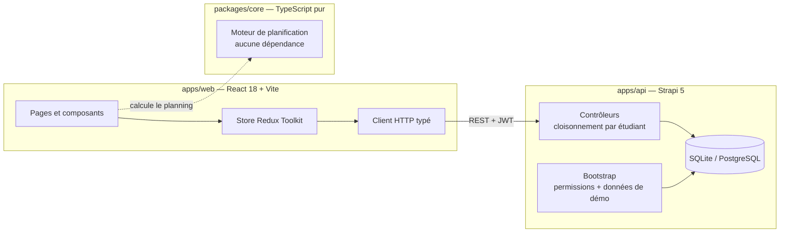
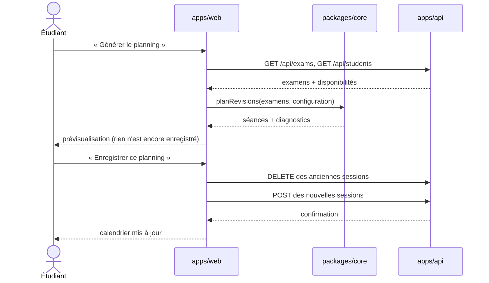
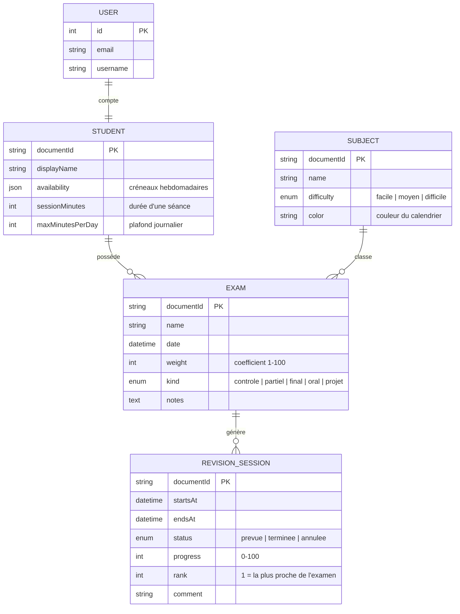
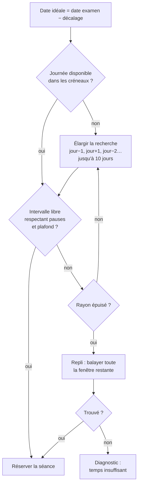
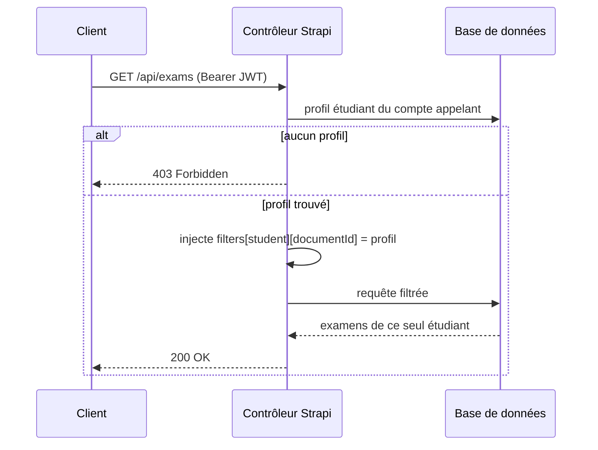
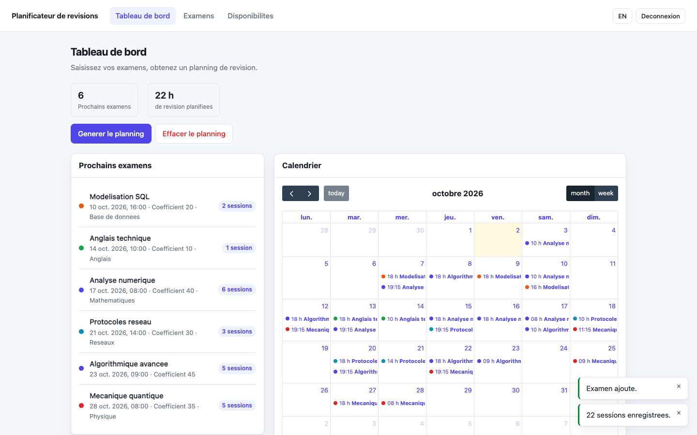
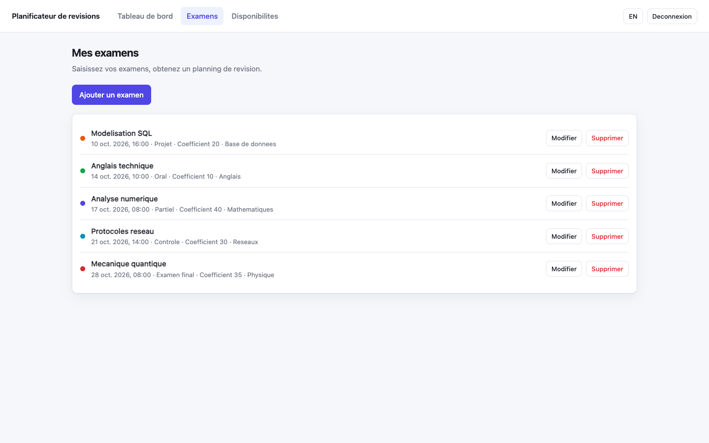

<h1 align="center">Planificateur de révisions</h1>

<p align="center">
  <strong>Vos examens d'un côté, un planning de révision de l'autre.</strong><br>
  <sub>Monorepo TypeScript — Strapi 5 · React 18 · Vite · 45 tests</sub>
</p>

<p align="center">
  
  
  
  
  
</p>

---

## Sommaire

1. [Le problème](#le-problème)
2. [Démonstration](#démonstration)
3. [Démarrage](#démarrage)
4. [Architecture](#architecture)
5. [Modèle de données](#modèle-de-données)
6. [Le moteur de planification](#le-moteur-de-planification)
7. [L'API](#lapi)
8. [Sécurité et cloisonnement](#sécurité-et-cloisonnement)
9. [L'interface](#linterface)
10. [Tests et qualité](#tests-et-qualité)
11. [Structure du dépôt](#structure-du-dépôt)
12. [Commandes](#commandes)
13. [Déploiement](#déploiement)
14. [Dépannage](#dépannage)
15. [Origine du projet](#origine-du-projet)

---

## Le problème

Un étudiant connaît ses échéances. Ce qu'il sait mal faire, c'est **répartir son
travail** entre elles :

- tout réviser la veille, ce que la recherche sur la mémoire identifie comme la
  stratégie la moins efficace ;
- pondérer l'effort selon l'importance réelle de chaque épreuve ;
- ne pas oublier les matières dont l'échéance est lointaine ;
- planifier des séances à des moments où l'on est réellement disponible.

**La solution.** L'étudiant saisit ses examens avec leur coefficient et leur
matière, déclare quand il accepte de réviser, et obtient un planning concret :
des séances datées, placées dans son calendrier, dont le volume dépend de
l'importance de l'épreuve et dont l'espacement suit le principe de la
**répétition espacée**.

---

## Démonstration


> Parcours complet : connexion, ajout d'un examen, déclaration des
> disponibilités, génération puis enregistrement du planning, vue calendaire,
> bascule en anglais.
> Vidéo en meilleure définition : [`docs/media/demonstration.mp4`](docs/media/demonstration.mp4).

---

## Démarrage

```bash
git clone https://github.com/aziz3r/revision-planner.git
cd revision-planner
npm install
npm run dev
```

| | |
|---|---|
| Interface | <http://localhost:5173> |
| API REST | <http://localhost:1337/api> |
| Administration Strapi | <http://localhost:1337/admin> |
| Compte de démonstration | `demo@revision-planner.local` / `Demo1234!` |

**Aucune configuration manuelle n'est nécessaire.** Au premier démarrage, le
backend crée la base SQLite, applique les permissions et injecte un jeu de
données de démonstration : 5 matières, 5 examens, un profil étudiant avec ses
disponibilités, et le compte ci-dessus. Les dates des examens sont **relatives au
jour du démarrage**, la démonstration reste donc pertinente quelle que soit la
date du clone.

Prérequis : Node.js ≥ 20. Docker n'est requis que pour la variante PostgreSQL.

---

## Architecture

Trois paquets, une seule source de types.



**Pourquoi isoler le moteur.** `packages/core` ne dépend ni de React ni de
Strapi : c'est du TypeScript pur. Il se teste donc directement, sans navigateur
ni base de données, et pourrait être réutilisé par une application mobile ou un
travail planifié côté serveur. C'est la décision d'architecture la plus
structurante du projet.

**Pourquoi un monorepo.** Le front et le moteur partagent exactement les mêmes
types, sans duplication ni paquet intermédiaire à publier.

### Flux de la génération d'un planning



Le calcul se fait **côté client**, à partir de données déjà chargées : la
prévisualisation est instantanée et n'écrit rien tant que l'étudiant n'a pas
confirmé.

---

## Modèle de données



Les schémas sont **versionnés** dans
[`apps/api/src/api/*/content-types/`](apps/api/src/api) : les noms de champs et
de relations sont fixes et typés, il n'y a rien à deviner à l'exécution.

Le champ `availability` est un tableau JSON de créneaux hebdomadaires :

```json
[
  { "weekday": 1, "start": "18:00", "end": "21:00" },
  { "weekday": 6, "start": "10:00", "end": "13:00" }
]
```

`weekday` suit la convention de `Date#getDay()` : 0 = dimanche, 6 = samedi.
Le contenu est **validé à la lecture** côté front : une saisie corrompue retombe
sur les créneaux par défaut au lieu de faire échouer la génération.

---

## Le moteur de planification

Implémenté dans [`packages/core`](packages/core) sous forme de fonctions pures.

### 1. Combien de temps pour chaque examen

```
minutes = ⌈ (coefficient × 6 × facteur_difficulté) / durée_séance ⌉ × durée_séance
```

| Difficulté | Facteur |
|---|:--:|
| facile | 0,75 |
| moyen | 1,00 |
| difficile | 1,35 |

L'arrondi au multiple supérieur traduit un choix explicite : on ne planifie pas
une fraction de séance. Sur le jeu de démonstration, avec des séances d'une heure :

| Examen | Coefficient | Difficulté | Calcul | Séances |
|---|:--:|:--:|---|:--:|
| Anglais technique | 10 | facile | 10 × 6 × 0,75 = 45 min → 60 | **1** |
| Modélisation SQL | 20 | moyen | 20 × 6 × 1 = 120 min | **2** |
| Protocoles réseau | 30 | moyen | 30 × 6 × 1 = 180 min | **3** |
| Mécanique quantique | 35 | difficile | 35 × 6 × 1,35 = 283 min → 300 | **5** |
| Analyse numérique | 40 | difficile | 40 × 6 × 1,35 = 324 min → 360 | **6** |

> Les constantes — 6 minutes par point de coefficient, facteurs 0,75 / 1 / 1,35 —
> sont des **choix de conception**, pas des valeurs issues de la littérature.
> Elles sont regroupées en tête de [`planner.ts`](packages/core/src/planner.ts)
> pour être ajustées facilement.

### 2. Quand les placer

Les écarts entre séances successives valent 1, 2, 3, 4… jours, ce qui donne les
décalages cumulés avant l'examen :

```
d(k) = k(k+1)/2   →   J-1, J-3, J-6, J-10, J-15, J-21, J-28…
```

La révision est dense à l'approche de l'épreuve et de plus en plus espacée en
remontant dans le temps. C'est le principe de la **répétition espacée**, qui
favorise la mémorisation durable plutôt que le bachotage.

**Adaptation à la fenêtre disponible.** Pour dix séances, le décalage le plus
lointain vaut 55 jours. Si l'examen a lieu dans vingt jours, viser ces dates
condamnerait la moitié des séances. Les décalages sont donc comprimés
proportionnellement :

```
d'(k) = round( d(k) × L / d(n) )   lorsque d(n) > L
```

où `L` est le nombre de jours réellement disponibles. L'ordre et la progression
des écarts sont conservés.

| | Décalages |
|---|---|
| Idéaux (10 séances) | 1, 3, 6, 10, 15, 21, 28, 36, 45, **55** |
| Comprimés sur 19 jours | 0, 1, 2, 3, 5, 7, 10, 12, 16, **19** |

### 3. Trouver un créneau



Les examens sont traités **du plus proche au plus lointain** : en cas de pénurie
de créneaux, ce sont les échéances lointaines qui cèdent, jamais l'épreuve de
demain.

### 4. Ce que le moteur garantit

| Garantie | Vérifiée par |
|---|---|
| Aucune séance dans le passé | test `ne planifie jamais dans le passe` |
| Aucune séance après l'examen | test `ne planifie jamais apres la date de l examen` |
| Marge de repos avant l'épreuve | test `respecte la marge de repos` |
| Aucun chevauchement, même entre examens différents | test `ne fait jamais chevaucher deux sessions` |
| Plafond journalier respecté | test `respecte le plafond de minutes par journee` |
| Pause minimale entre deux séances | test `respecte la pause minimale` |
| Priorité aux échéances proches | test `sert en priorite les examens les plus proches` |
| Résultat déterministe | test `est deterministe` |

### 5. Diagnostics

Une séance non placée n'est jamais omise en silence. Le moteur renvoie une cause
explicite, affichée à l'étudiant **avant** l'enregistrement :

| Cause | Signification |
|---|---|
| `examen-passe` | L'épreuve a déjà eu lieu, ou la marge de repos est dépassée. |
| `aucune-disponibilite` | Aucun créneau hebdomadaire n'est déclaré. |
| `temps-insuffisant` | Les créneaux libres ne suffisent pas au volume nécessaire. |

### 6. Validation des entrées

Une donnée invalide provoque une erreur nommée, jamais un résultat silencieusement
faux :

```ts
if (!Number.isFinite(exam.weight)) {
  throw new RangeError(`Coefficient invalide pour "${exam.name}" : ${exam.weight}`)
}
```

### Paramètres par défaut

| Paramètre | Valeur | Réglable par l'étudiant |
|---|:--:|:--:|
| Durée d'une séance | 60 min | ✅ |
| Pause entre deux séances | 15 min | — |
| Plafond journalier | 180 min | ✅ |
| Marge de repos avant l'examen | 12 h | — |
| Créneaux par défaut | tous les soirs 18 h – 21 h | ✅ |

---

## L'API

Toutes les routes `/api/*` exigent un jeton JWT, sauf indication contraire.

| Méthode | Route | Rôle |
|---|---|---|
| `POST` | `/api/auth/local` | Connexion, retourne un JWT |
| `POST` | `/api/auth/local/register` | Création de compte |
| `GET` | `/api/subjects` | Matières *(accessible sans compte)* |
| `GET` | `/api/exams` | Examens **du compte appelant uniquement** |
| `POST` | `/api/exams` | Création — la relation `student` est imposée par le serveur |
| `PUT` | `/api/exams/:documentId` | Modification, réaffectation impossible |
| `DELETE` | `/api/exams/:documentId` | Suppression |
| `GET` | `/api/revision-sessions` | Séances rattachées aux examens du compte |
| `POST` | `/api/revision-sessions` | Création, après vérification de l'examen cible |
| `DELETE` | `/api/revision-sessions/:documentId` | Suppression |
| `GET` | `/api/students` | Profil du compte appelant |
| `PUT` | `/api/students/:documentId` | Disponibilités et préférences |

Exemple de requête, avec les relations peuplées :

```bash
TOKEN=$(curl -s -X POST http://localhost:1337/api/auth/local \
  -H 'Content-Type: application/json' \
  -d '{"identifier":"demo@revision-planner.local","password":"Demo1234!"}' \
  | python3 -c 'import sys,json; print(json.load(sys.stdin)["jwt"])')

curl -s "http://localhost:1337/api/exams?populate[subject][fields][0]=name&sort=date:asc" \
  -H "Authorization: Bearer $TOKEN"
```

---

## Sécurité et cloisonnement



- **Lecture** : le filtre est injecté côté serveur, le client ne peut pas
  l'élargir.
- **Écriture** : la relation `student` est écrasée par le serveur ; un examen ne
  peut être ni créé pour autrui, ni réaffecté.
- **Sessions** : la propriété est vérifiée en remontant jusqu'à l'examen parent.
- **Profil** : le rattachement au compte utilisateur n'est pas modifiable par l'API.
- **Sans jeton** : `403`.

Le filtrage n'est **jamais** délégué au navigateur.

---

## L'interface

| Prévisualisation avant enregistrement | Déclaration des disponibilités |
|---|---|
|  |  |
| Volume nécessaire, volume planifié, et chaque séance datée avec son rang et son écart à l'examen. Rien n'est écrit tant que l'étudiant n'a pas confirmé. | Le planning ne propose que les plages déclarées. |

| Tableau de bord | Liste des examens |
|---|---|
|  |  |
| Prochaines épreuves, nombre de séances par examen, calendrier FullCalendar. | Création, modification et suppression, avec matière et coefficient. |

Autres caractéristiques : interface traduite **français / anglais** (parité des
clés vérifiée par un test), thème **clair et sombre** suivant les préférences du
système, et affichage adapté au **mobile**.

---

## Tests et qualité

```bash
npm test          # 45 tests
npm run typecheck # TypeScript strict sur les trois paquets
```

| Paquet | Tests | Portée |
|---|:--:|---|
| `packages/core` | **32** | volume de révision, espacement, garanties de placement, cas limites, validation des entrées |
| `apps/web` | **13** | sérialiseur de requêtes Strapi, parité des traductions, conversion des données API → moteur |

**TypeScript strict**, sans aucun `any`, avec `noUncheckedIndexedAccess` et
`exactOptionalPropertyTypes` activés.

**Démonstration reproductible.** [`scripts/capture-demo.mjs`](scripts/capture-demo.mjs)
réinitialise les données, pilote l'application avec Playwright, enregistre une
image à chaque étape et assemble vidéo et GIF avec ffmpeg :

```bash
npm run demo:capture
```

La démonstration se régénère donc après chaque évolution de l'interface, au lieu
d'être un enregistrement manuel vite périmé.

---

## Structure du dépôt

```
revision-planner/
├── packages/core/                  Moteur de planification — TypeScript pur
│   ├── src/
│   │   ├── planner.ts              Volume, répétition espacée, placement
│   │   ├── time.ts                 Utilitaires de dates, sans dépendance
│   │   ├── types.ts                Modèle du domaine
│   │   └── index.ts
│   └── tests/planner.test.ts       32 tests
│
├── apps/api/                       Backend Strapi 5
│   └── src/
│       ├── api/                    exam · revision-session · student · subject
│       │   └── <type>/
│       │       ├── content-types/  schéma versionné
│       │       ├── controllers/    cloisonnement par étudiant
│       │       ├── routes/
│       │       └── services/
│       ├── bootstrap/
│       │   ├── permissions.ts      permissions appliquées au démarrage
│       │   └── seed.ts             données de démonstration
│       ├── utils/ownership.ts      résolution du profil appelant
│       └── index.ts
│
├── apps/web/                       Frontend React 18 + Vite
│   ├── src/
│   │   ├── api/                    client HTTP typé, types des réponses
│   │   ├── auth/                   session, accès protégés
│   │   ├── components/             Layout · Toaster · ErrorBanner · RequireAuth
│   │   ├── features/planner/       conversion API → moteur, persistance
│   │   ├── pages/                  Dashboard · Exams · Availability · Login…
│   │   ├── store/                  slices Redux Toolkit
│   │   └── i18n/                   fr.json · en.json
│   └── tests/                      13 tests
│
├── scripts/capture-demo.mjs        Capture automatisée de la démonstration
├── docs/
│   ├── rapport/                    Rapport technique LaTeX + PDF
│   └── media/                      Vidéo, GIF et captures
└── docker-compose.yml              Variante PostgreSQL
```

---

## Commandes

| Commande | Effet |
|---|---|
| `npm run dev` | Démarre l'API et l'interface simultanément |
| `npm run dev:api` | API seule, avec rechargement |
| `npm run dev:web` | Interface seule |
| `npm run build` | Construit les trois paquets |
| `npm test` | Exécute les 45 tests |
| `npm run typecheck` | Vérifie les types sans produire de fichiers |
| `npm run demo:capture` | Régénère la vidéo et le GIF de démonstration |

---

## Déploiement

### PostgreSQL

SQLite suffit au développement. Pour se rapprocher d'un déploiement réel :

```bash
docker compose up -d postgres

DATABASE_CLIENT=postgres DATABASE_HOST=localhost DATABASE_PORT=5432 \
DATABASE_NAME=revision_planner DATABASE_USERNAME=strapi DATABASE_PASSWORD=strapi \
npm run dev
```

### Variables d'environnement

`apps/api/.env` — voir [`apps/api/.env.example`](apps/api/.env.example) :

| Variable | Rôle |
|---|---|
| `APP_KEYS`, `JWT_SECRET`, `ADMIN_JWT_SECRET`, `API_TOKEN_SALT`, `TRANSFER_TOKEN_SALT`, `ENCRYPTION_KEY` | Secrets Strapi — à régénérer en production |
| `DATABASE_CLIENT` | `sqlite` ou `postgres` |
| `DATABASE_FILENAME` | Chemin de la base SQLite |
| `SEED_DEMO_DATA` | `false` pour désactiver les données de démonstration |

`apps/web/.env` — voir [`apps/web/.env.example`](apps/web/.env.example) :

| Variable | Rôle |
|---|---|
| `VITE_API_URL` | URL du backend, `http://localhost:1337` par défaut |

### Production

```bash
npm run build
npm run start --workspace api   # API
# puis servir apps/web/dist avec n'importe quel serveur statique
```

---

## Dépannage

| Symptôme | Cause et remède |
|---|---|
| `SqliteError: unable to open database file` | `DATABASE_FILENAME` vide dans `.env` : Strapi tente d'ouvrir un répertoire. Renseigner `.tmp/data.db`. |
| `403` sur toutes les routes | Le bootstrap des permissions n'a pas tourné. Relancer l'API ; l'opération est idempotente. |
| Base vide au démarrage | `SEED_DEMO_DATA=false`, ou la base contient déjà des matières — le seed ne s'exécute que sur une base vierge. |
| Redémarrages en boucle de l'API | Le dépôt est dans un dossier synchronisé (iCloud Drive, OneDrive). Les démons de synchronisation génèrent des événements que les observateurs de fichiers interprètent comme des modifications. Déplacer le projet hors de ces dossiers. |
| `npm install` échoue sur des paquets corrompus | Cache npm abîmé par une installation interrompue : `rm -rf node_modules && npm cache clean --force && npm install`. |

---

## Origine du projet

Ce projet est né d'un **stage d'un mois chez [Anypli](https://anypli.com), en
Tunisie**, pendant l'été 2025.

Je n'avais alors **aucune expérience du développement web**. TypeScript, React,
Redux, le fonctionnement d'une API REST, un CMS découplé comme Strapi : tout a
été découvert sur place, à partir de zéro, en quatre semaines — en même temps que
l'application se construisait. L'historique Git de ce dépôt en conserve la trace,
des premiers essais de mi-juillet 2025 à la version livrée le 15 août.

Apprendre une pile technique entière et livrer dans le même mois impose des
compromis. L'application fonctionnait et répondait au besoin, mais elle portait
les marques de cet apprentissage accéléré. La refonte qui a suivi relève d'une
autre compétence : non plus faire fonctionner, mais rendre **fiable**.

| | Version du stage | Après refonte |
|---|---|---|
| Backend | configuré à la main, non versionné | schémas, permissions et données dans le dépôt |
| Lancement par un tiers | impossible | `npm install && npm run dev` |
| Planification | 18 lignes : coefficient ÷ 10, toujours 18 h | moteur isolé : difficulté, disponibilités, collisions, diagnostics |
| Séances dans le passé | générées | impossibles par construction |
| Filtrage des données | navigateur, après avoir tout téléchargé | serveur, par contrôleur |
| Noms de relations | devinés à l'exécution parmi trois candidats | modèle fixe et typé |
| Retours utilisateur | `alert()` bloquants | notifications et prévisualisation |
| Tests | 1 test de fumée | **45** |
| TypeScript | `any` omniprésent | strict, sans `any` |

Les 22 premiers commits de ce dépôt sont ceux du stage ; ils n'ont pas été
modifiés. Le commit *« Retirer la version 1 avant la refonte »* marque la bascule.

📄 **[Rapport technique — 19 pages](docs/rapport/rapport.pdf)** : contexte du
stage, technologies découvertes, limites de la première version, architecture de
la refonte, algorithme détaillé, difficultés rencontrées et bilan d'apprentissage.
Source LaTeX et instructions de compilation dans [`docs/rapport/`](docs/rapport).

---

## Pistes d'évolution

- rendre les constantes du moteur configurables par l'étudiant ;
- gérer explicitement les fuseaux horaires, aujourd'hui alignés sur celui du navigateur ;
- tenir compte de l'avancement réel des séances pour replanifier ce qui n'a pas été fait ;
- exporter le planning au format iCalendar.

---

<p align="center"><sub>Mohamed Aziz Baoueb — stage chez Anypli, Tunisie, été 2025</sub></p>
